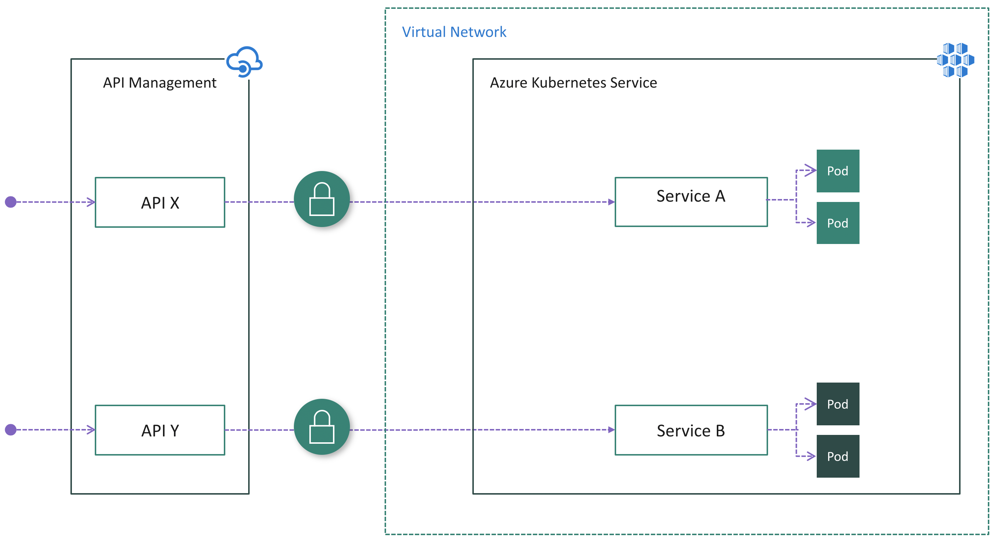
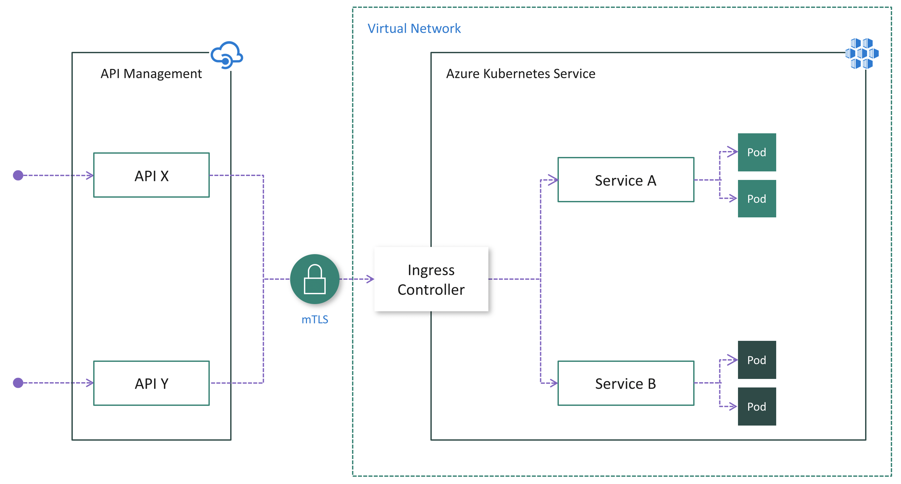
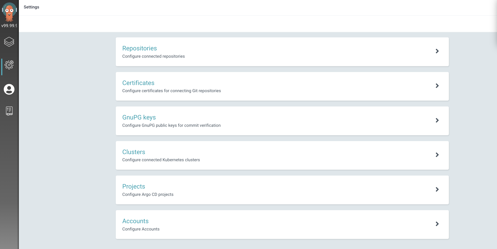
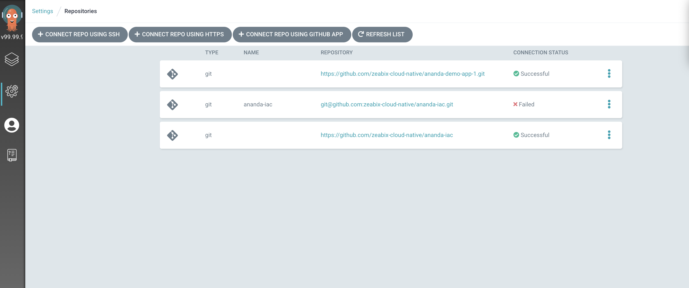
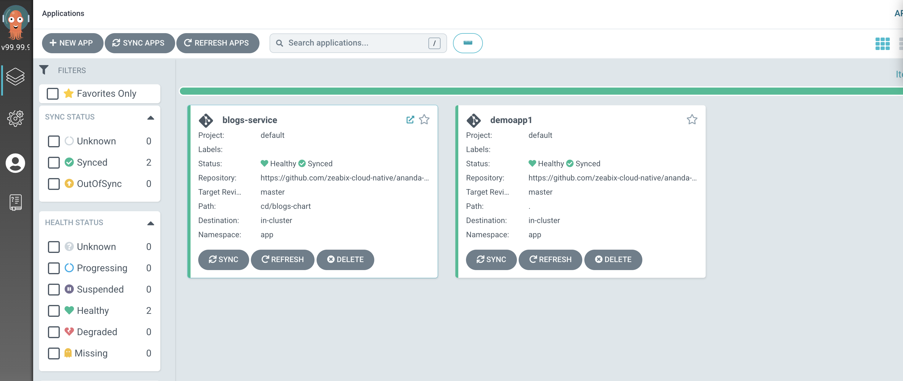
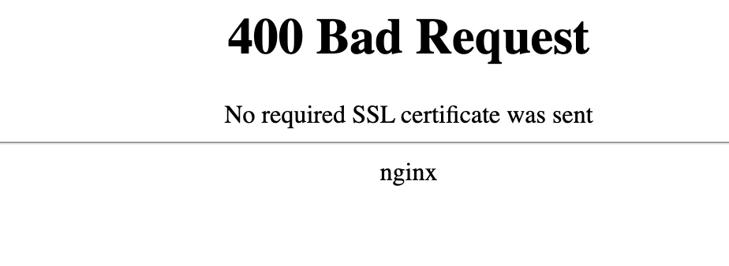

## Use Azure API Management with microservices deployed in Azure Kubernetes Service
Concept chart


### AKS Ingress mTLS



Pros:
- Easy configuration on the API Management side because it does not need to be injected into the cluster VNet and mTLS is natively supported
- Centralizes protection for inbound cluster traffic at the Ingress Controller layer
Reduces security risk by minimizing publicly visible cluster endpoints

Cons:
- Increases complexity of cluster configuration due to extra work to install, configure and maintain the Ingress Controller and manage certificates used for mTLS
- Security risk due to public visibility of Ingress Controller endpoint(s)

Creating Kubernetes Secrets for Client cert
```sh
# Add client.crt, client.key and ca.crt into Kubernetes secret named ingress-secret-self
$ kubectl create secret generic ingress-secret-self --from-file=tls.crt=client.crt --from-file=tls.key=client.key --from-file=ca.crt=ca.crt -n app

# Display the secret
$ kubectl get secret ingress-secret-self -n app

# List all secrets in the cluster
$ kubectl get secrets -A
```
Creating Kubernetes Secrets for Server cert
```sh
# Add client.crt, client.key and ca.crt into Kubernetes secret named ingress-secret-self
$ kubectl create secret generic ingress-secret-dev --from-file=tls.crt=server.crt --from-file=tls.key=server.key --from-file=ca.crt=ca.crt -n app

# Display the secret
$ kubectl get secret ingress-secret-self -n app

# List all secrets in the cluster
$ kubectl get secrets -A
```
## Deploy the Application to AKS using ArgoCD
## Setup Helm Chart for Service
```sh
$ helm create blog-chart
```
`values.yaml`
```yaml
# Default values for blogs-chart.
# This is a YAML-formatted file.
# Declare variables to be passed into your templates.

replicaCount: 1

image:
  # Docker image repository 
  repository: anandaacr.azurecr.io/blog-service
  pullPolicy: IfNotPresent
  # Overrides the image tag whose default is the chart appVersion.
  tag: "v1.0.0"

imagePullSecrets: []
nameOverride: ""
fullnameOverride: ""

serviceAccount:
  # Specifies whether a service account should be created
  create: false
  # Annotations to add to the service account
  annotations: {}
  # The name of the service account to use.
  # If not set and create is true, a name is generated using the fullname template
  name: ""

podAnnotations: {}

podSecurityContext: {}
  # fsGroup: 2000

securityContext: {}
  # capabilities:
  #   drop:
  #   - ALL
  # readOnlyRootFilesystem: true
  # runAsNonRoot: true
  # runAsUser: 1000

service:
  type: ClusterIP
  port: 80

ingress:
  enabled: true
  className: ""
  annotations: 
    kubernetes.io/ingress.class: "nginx"
    nginx.ingress.kubernetes.io/ssl-redirect: "true"
    nginx.ingress.kubernetes.io/auth-tls-verify-client: "on"
    nginx.ingress.kubernetes.io/auth-tls-secret: "app/ingress-secret-self"
    nginx.ingress.kubernetes.io/whitelist-source-range : "20.198.210.67/32"
  hosts:
    - host: blog.z-unified.com
      paths:
        - path: /
          pathType: ImplementationSpecific
  tls: 
   - hosts:
        - blog.z-unified.com
     secretName: ingress-secret-dev 

resources:
  limits:
    cpu: 100m
    memory: 128Mi
  requests:
    cpu: 100m
    memory: 128Mi

autoscaling:
  enabled: false
  minReplicas: 1
  maxReplicas: 100
  targetCPUUtilizationPercentage: 80
  targetMemoryUtilizationPercentage: 80

nodeSelector: {}

tolerations: []

affinity: {}

app_env:
  mongo_url: "mongodb://mongodb.db.svc.cluster.local:27017"
  mongo_db_name: "blogs"
  mongo_collection_name: "blogs"


```
***Push it to git repoitory***

## ArgoCD
To run access server ArgoCD run this commands
```sh
$ kubectl port-forward svc/argocd-argo-cd-server -n argocd 8080:443
```
default Username is `Admin` , Argo CD server admin password. Autogenerated by default.
run this commands to get password
```sh
$ kubectl -n argocd get secret argocd-secret -o jsonpath="{.data.clearPassword}" | base64 -d
```

1. go to `https://localhost:8080`
2. Login to `ArgoCD Dashboard`
3. go to manage repository and setting page -> Repository


4. Setup git reposity which helm chart are store in this case (https://github.com/zeabix-cloud-native/ananda-iac)


5. Go to Manage Application Page -> + New APP
[General]
  - Define Application Name 
  - Project Name set `Default`
[Source]
  - Define Git Repositoy
  - Choose Revision
  - Define Path that store helm chart (blog-chart) 
  - Define Name space
  - `Create` Application
  
6. Follow previos step Appication,Deploment,Ingress will create and Comunication betwenn client and server will use `mTLS`   

## Add A Record to DNS
Now the static IP of the AKS ingress controller is available. You can map it to the domain (blog.z-unified.com ) in your DNS setup.

## Testing AKS Configuration for mTLS Authentication
With client cert authentication and CA cert configured in AKS ingress resource, we can test it using curl client.
- If you call the ingress without supplying the client cert or client key, you will get the following error

```sh
$ curl -k https://blog.z-unified.com 
```
```html
<html> <head><title>400 No required SSL certificate was sent</title></head> <body></body></html>
```    


 - Mutual TLS authentication between AKS and curl client can be achieved by supplying client cert, client key and CA cert, as shown below.
 ```sh
 $ curl -v https://blog.z-unified.com --cert client.crt --key client.key
 ```
 - If our test application returns the incoming headers, it looks like below
 In its response, in addition to the correct response from the AKS pods, the following verbose section indicates client authentication of server cert is successful.
 ```text
 * Server certificate:
*  subject: CN=*.z-unified.com
*  start date: Oct 11 00:00:00 2022 GMT
*  expire date: Jul  9 23:59:59 2023 GMT
*  subjectAltName: host "blog.z-unified.com" matched cert's "*.z-unified.com"
*  issuer: C=GB; ST=Greater Manchester; L=Salford; O=Sectigo Limited; CN=Sectigo RSA Domain Validation Secure Server CA
*  SSL certificate verify ok.
* Using HTTP2, server supports multiplexing
* Connection state changed (HTTP/2 confirmed)
* Copying HTTP/2 data in stream buffer to connection buffer after upgrade: len=0
* Using Stream ID: 1 (easy handle 0x7ff39c80d400)
> GET /blogs/v1/blogs HTTP/2
> Host: blog.z-unified.com
> user-agent: curl/7.79.1
> accept: */*
 ```

## Configuring mTLS in API Management
etails can be found in [How to secure back-end services using client certificate authentication in Azure API Management.](https://learn.microsoft.com/en-us/azure/api-management/api-management-howto-mutual-certificates)

### Upload a certificate
To upload a client certificate to API Management:
1. In the `Azure portal`, navigate to your API Management instance.
2. Under Security, select Certificates.
3. Select Certificates > + Add.
4. In Id, enter a name of your choice.

### Configure an API to use client certificate for gateway authentication
1. In the `Azure portal`, navigate to your API Management instance.
2. Under APIs, select APIs.
3. Select an API from the list.
4. In the Design tab, select the editor icon in the Backend section.
5. In Gateway credentials, select Client cert and select your certificate from the dropdown.
6. Select `Save`.


